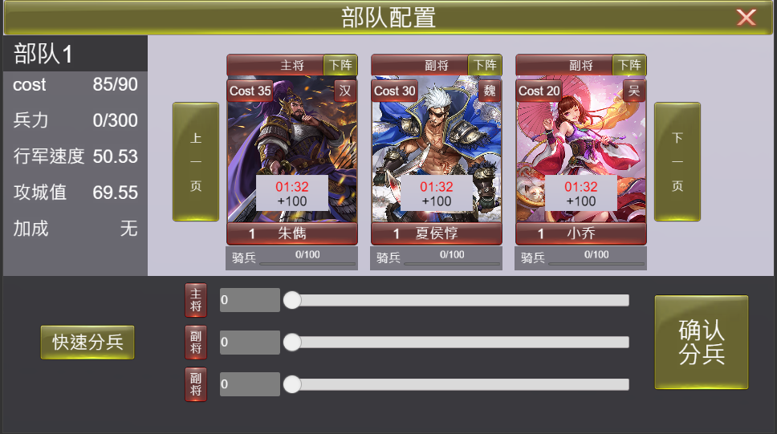
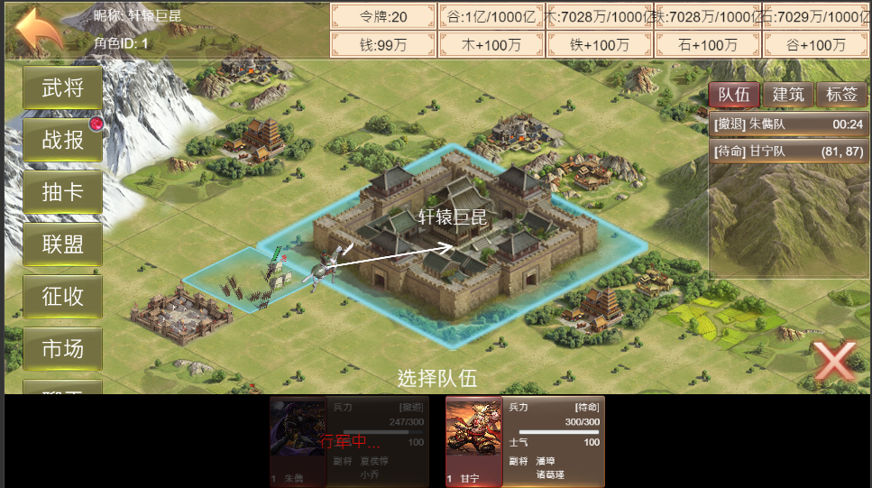
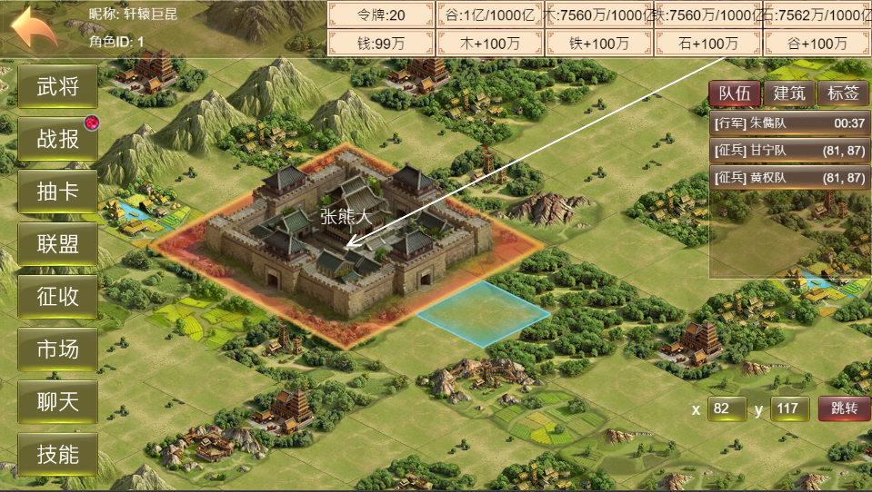
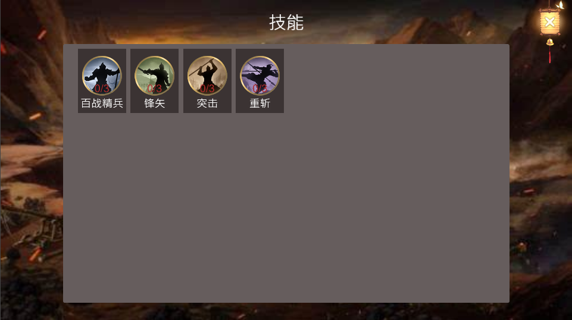
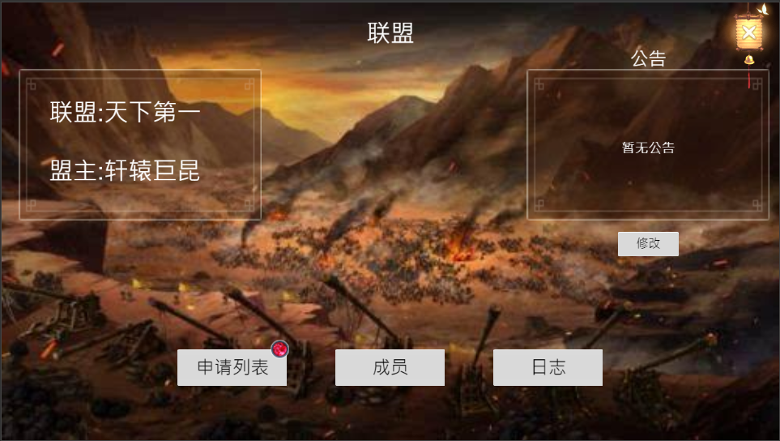
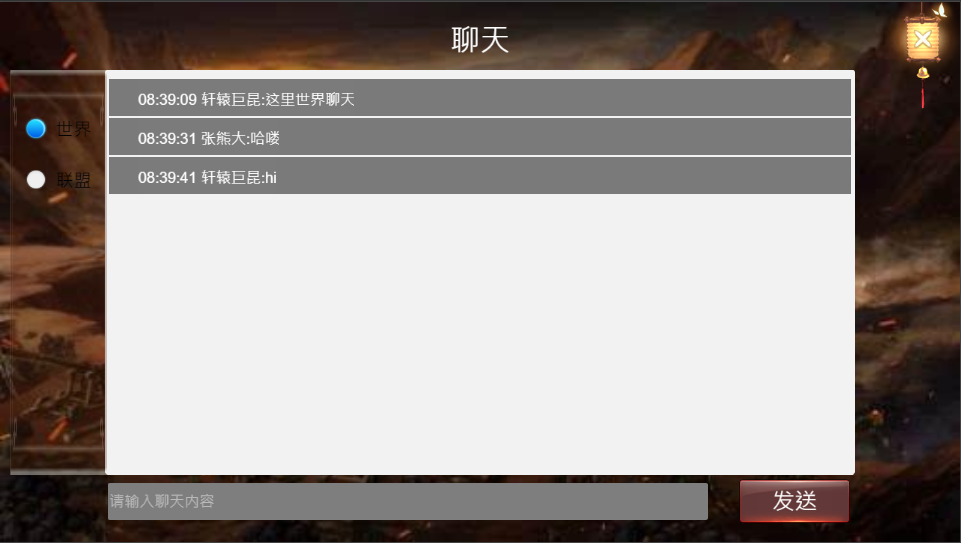

# slg游戏服务器demo

## 客户端demo：https://github.com/llr104/slgclient
**鄙视b站、抖音 up主码神之路，从这里拿demo讲课也不说出处，忽悠小白是自己写的**

**代码交流群：1054084192**

## 概要
- mysql数据落地，orm映射
- 事件处理支持中间件
- 服务器与服务器之间websocket连接
- 服务器与服务器之间rpc调用
- 高并发

### 多进程服务
- httpserver  提供一些api调用
- gateserver  网关，可以部署多个进行负债均衡，客户端的所有loginserver、chatserver、slgserver的消息都通过该服进行转发
- loginserver 登录服，可以部署多个进行负债均衡
- chatserver  聊天服，可以部署多个，原则上一个slgserver对应一个chatserver
- slgserver   游戏服，可以部署多个，不同服之间的玩家数据不共通

### 服务端使用简要介绍
- cd slgserver
- 项目已经使用go mod管理，推荐使用goland打开
- 创建MySQL数据库：在MySQL中执行 data/conf/db.sql 文件创建服务所需的数据库，库名默认为slgdb
- 修改配置： 修改 data/conf/env.ini 中数据库的配置，主要是密码、端口修改成自己所使用的一致即可，其他保持默认即可
- 拉取依赖包：命令行执行 go mod tidy
- 生成可执行程序： main 目录下包含了 httpserver、gateserver、loginserver、chatserver、slgserver 5个进程的代码，
  通过 go build main/xxxserver.go(上方5个进程源代码)即可生成 5个进程执行文件，在windows环境下也可以在直接执行 shell/build.bat
  生成5个进程可执行文件，可执行文件会存放在bin目录下
- 复制配置文件到工作目录：将data文件夹拷贝到bin目录下，5个进程会用到data里的配置， window环境可以运行shell/copydata.bat完成拷贝操作
- 启动运行：启动5个进程，无顺序要求，windows环境下可以运行shell/run.bat代劳
- 客户端联调：cocos creator打开客户端运行即可联机测试
- 注意在goland中点击对应的进程 run 或者 debug 前需要将输出路径和工作路径都设置成bin目录，
  并且data目录已经拷贝到bin目录下，否则进程找不到运行的配置文件会异常终止

### 服务部署

**支持docker-compose 一键部署，数据库和表都会创建好的，步骤如下：**

1. **部署需要编译go源码，编译比较占内存，内存2G以下有可能编译不成功，请保证编译内存在2G以上**

2. **cd slgserver**

3. **docker-compose up**

4. **修改客户端 GameConfig.ts 文件中的连接地址**

   ```typescript
   import { _decorator } from 'cc';
   const GameConfig = {
       serverUrl: "ws://127.0.0.1:8004", //httpserver 地址
       webUrl: "http://127.0.0.1:8088",  //gateserver 地址
   }
   export { GameConfig };
   
   ```

   

## 客户端截图

### 队伍征兵


### 占领领地


### 出征返回


### 城内设施


### 武将


### 武将详情


### 友方主城


### 敌方主城


### 军队前往敌方主城


### 抽卡结果


### 战报


### 技能


### 联盟


### 聊天

